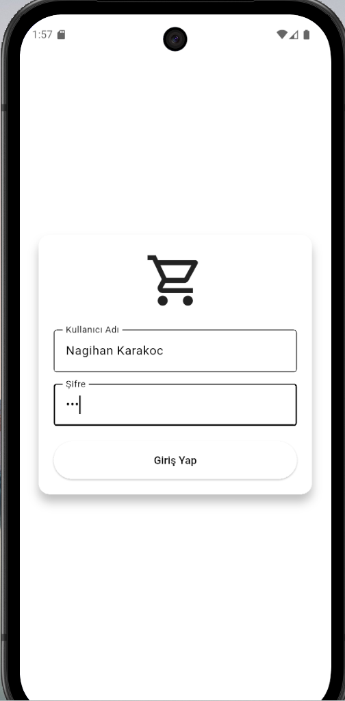
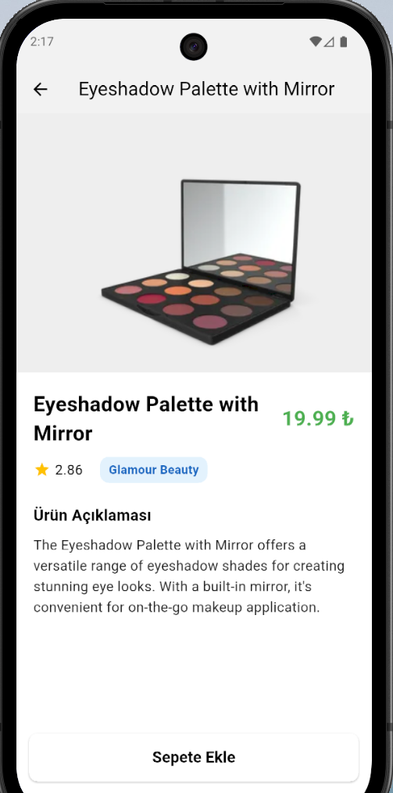

# 📱 Mini Katalog Uygulaması

## 📌 Proje Açıklaması

Bu proje Flutter kullanılarak geliştirilmiş basit bir ürün katalog uygulamasıdır.
Kullanıcı giriş yaptıktan sonra API üzerinden ürünleri listeleyebilir.

Login ekranında şifre: 123

## 🚀 Özellikler

* 🔐 Login ekranı
* 🌐 API'den veri çekme (DummyJSON)
* 📦 Ürün listeleme
* 👤 Kullanıcı adı gösterme
* 🚪 Logout işlemi

## 🛠 Kullanılan Teknolojiler

* Flutter
* Dart
* HTTP Package

## 📦 Flutter Sürümü

Flutter 3.x.x

## ▶️ Uygulamayı Çalıştırma

```bash
git clone https://github.com/nagihankarakoc/mini-katalog-app.git
cd mini-katalog-app
flutter pub get
flutter run
```
## 📸 Ekran Görüntüleri





